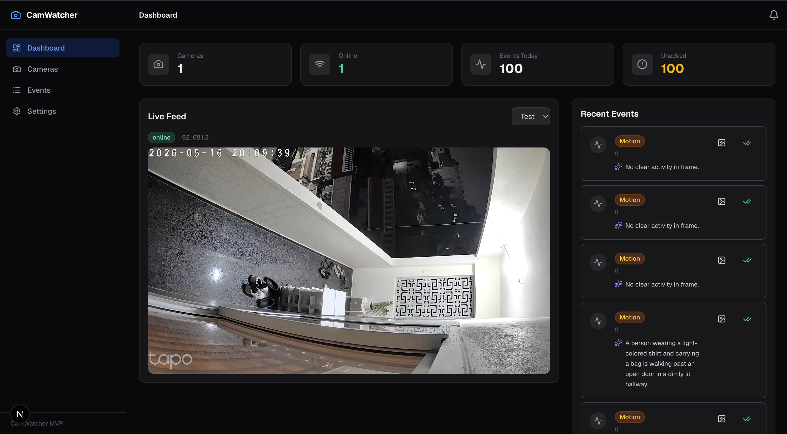
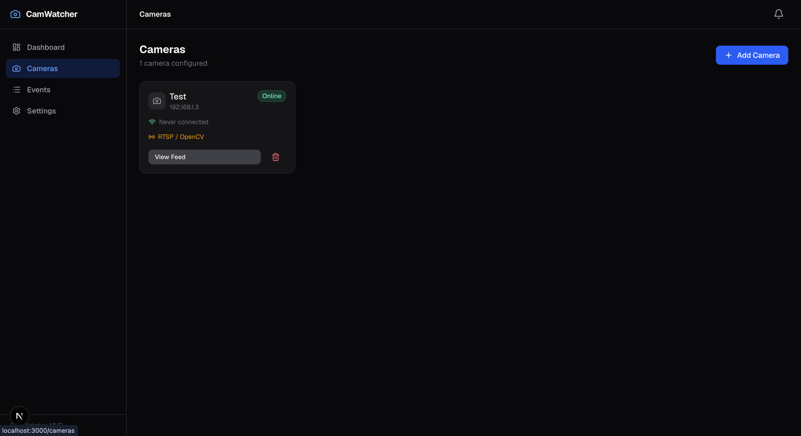
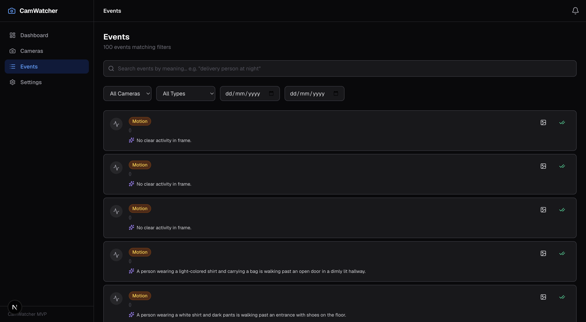
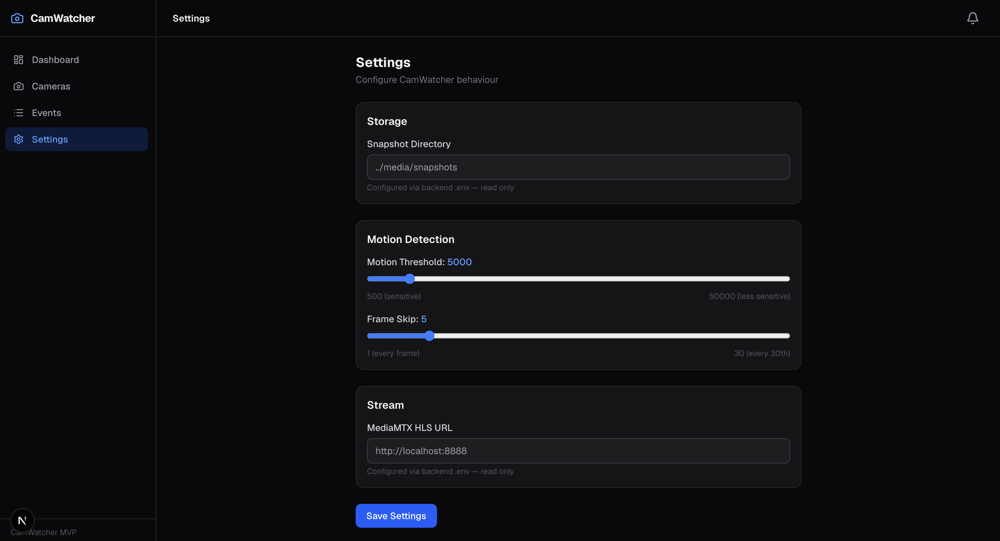

<div align="center">

# CamWatcher

**AI intelligence layer for your existing IP cameras.**

Turn a TP‑Link Tapo (or any RTSP camera) into a private, searchable, event‑aware system — running entirely on your local machine.

[](https://www.python.org/)
[](https://fastapi.tiangolo.com/)
[](https://nextjs.org/)
[](https://tailwindcss.com/)
[](https://github.com/bluenviron/mediamtx)
[](LICENSE)
[](#privacy--security)

</div>

---

## Screenshots

<table>
  <tr>
    <td align="center"><b>Dashboard — live feed + AI event summary</b></td>
    <td align="center"><b>Cameras — manage connected cameras</b></td>
  </tr>
  <tr>
    <td></td>
    <td></td>
  </tr>
  <tr>
    <td align="center"><b>Events — 100 motion events with AI descriptions</b></td>
    <td align="center"><b>Settings — motion threshold, frame skip, storage</b></td>
  </tr>
  <tr>
    <td></td>
    <td></td>
  </tr>
</table>

---

## Why CamWatcher

Most consumer cameras (Tapo, Reolink, generic ONVIF) ship a "good enough" mobile app and a closed cloud. CamWatcher leaves the hardware untouched and gives you the missing layer:

- **A real dashboard** — live HLS feed, recent events, camera health, all in one screen.
- **Local AI on every frame** — OpenCV motion detection runs continuously, no cloud round‑trip.
- **Optional vision summaries** — opt‑in OpenAI Vision describes what was actually seen ("person walked past front door").
- **Semantic event search** — find clips by what they show, not just by timestamp.
- **Real‑time updates** — WebSocket pushes new events to every open tab the instant they happen.
- **Your data, your disk** — SQLite + local snapshots. No Supabase, no S3, no telemetry.

> The browser **never** talks RTSP. Every stream is normalized through MediaMTX into clean HLS, so playback works on Chrome, Safari, Firefox and mobile without any plugins.

---

## Architecture

```
┌────────────────┐     RTSP      ┌──────────────┐     HLS      ┌─────────────────┐
│  Tapo Camera   │ ─────────────▶│   MediaMTX   │─────────────▶│  Next.js + hls.js│
└────────────────┘               └──────┬───────┘              └─────────────────┘
                                        │ RTSP re‑publish
                                        ▼
                                 ┌──────────────┐
                                 │ Python RTSP  │
                                 │   Worker     │  (one per camera, OpenCV)
                                 └──────┬───────┘
                                        │ motion events + snapshots
                                        ▼
                                 ┌──────────────┐    WebSocket   ┌─────────────────┐
                                 │ FastAPI +    │───────────────▶│   Dashboard      │
                                 │   SQLite     │                │  (real‑time)     │
                                 └──────┬───────┘                └─────────────────┘
                                        │ (optional)
                                        ▼
                                 ┌──────────────┐
                                 │ OpenAI Vision│  → AI summaries + embeddings
                                 │  + Embeddings│      for semantic search
                                 └──────────────┘
```

**Key principle:** there is exactly **one** RTSP session per camera. The Python worker reads MediaMTX's republished stream, never the camera directly — which sidesteps the Tapo "two clients = dropped frames" issue.

---

## Features

| Area | What you get |
|---|---|
| **Live video** | HLS playback in any modern browser via [`hls.js`](https://github.com/video-dev/hls.js), ~2s latency |
| **Multi‑camera** | Add as many Tapo / generic RTSP cameras as you like; each gets its own worker |
| **Motion detection** | OpenCV background subtraction with a tunable score threshold |
| **Snapshots** | JPEG of the moment of motion saved to `media/snapshots/{camera_id}/` |
| **Event timeline** | Filter by camera, type, date; click for full‑size snapshot |
| **AI summaries** | Optional GPT‑4o‑mini describes each event in plain English |
| **Semantic search** | Embed events and search by meaning ("anyone holding a package?") |
| **Real‑time push** | WebSocket broadcasts new events to all connected clients |
| **Encrypted credentials** | RTSP passwords stored encrypted (Fernet / `cryptography`) |
| **Status polling** | Active health check per camera; dashboard reflects online/offline |
| **Settings UI** | Adjust motion sensitivity, frame skip, snapshot path from the browser |

---

## Tech stack

| Layer | Choice | Why |
|---|---|---|
| Frontend | **Next.js 16** (App Router) + **Tailwind 4** + **TypeScript** | Modern, fast, great DX for dashboards |
| Backend | **FastAPI** + **SQLAlchemy 2** + **Pydantic v2** | Async, typed, batteries included |
| Database | **SQLite** | Zero‑setup, single file, perfect for local |
| Stream gateway | **MediaMTX** | One binary, RTSP → HLS, exposes a control API |
| CV | **OpenCV (headless)** | Mature, CPU‑only, no GPU required |
| AI (optional) | **OpenAI Vision + Embeddings** | High quality summaries and semantic search |
| Camera integration | [`pytapo`](https://github.com/JurajNyiri/pytapo) | Native Tapo support for status / config |
| Real‑time | **WebSockets** | Native FastAPI, no broker needed |

---

## Prerequisites

- **macOS** or **Linux** (tested on macOS Sonoma+)
- **Python 3.11+** with `pip` and `venv`
- **Node.js 20+** with `npm`
- **MediaMTX** binary (provided in [`mediamtx/`](mediamtx/) — see [Download MediaMTX](#downloading-mediamtx) below if it's missing)
- A camera that speaks **RTSP** (any Tapo C‑series works out of the box)

---

## Quickstart

CamWatcher runs as three processes. Open three terminals.

### 1. Start MediaMTX

```bash
cd mediamtx
chmod +x mediamtx
./mediamtx mediamtx.yml
```

MediaMTX exposes:

- RTSP server `rtsp://localhost:8554`
- HLS server `http://localhost:8888`
- Control API `http://localhost:9997`

Smoke test:

```bash
curl http://localhost:9997/v3/config/global/get
```

### 2. Start the backend

```bash
cd backend
python3 -m venv venv
source venv/bin/activate            # Windows: venv\Scripts\activate
pip install -r requirements.txt

cp ../.env.example .env             # then edit SECRET_KEY etc.
python run.py
```

API on `http://localhost:8000`. Health check:

```bash
curl http://localhost:8000/api/health
```

### 3. Start the frontend

```bash
cd frontend
cp .env.local.example .env.local    # adjust if needed
npm install
npm run dev
```

Open **<http://localhost:3000>** — you'll be redirected to `/dashboard`.

---

## Adding your first camera

1. Open **Cameras → Add Camera**
2. Fill in:
   - **Name** — e.g. `Front Door`
   - **IP** — your camera's local IP, e.g. `192.168.1.100`
   - **Username** — `admin` (or your Tapo username)
   - **Password** — your camera's RTSP password
   - **RTSP Path** — `stream1` (Tapo default, 1080p) or `stream2` (360p)
3. Click **Test Connection** — you should see "Connection successful"
4. Click **Add Camera**

Behind the scenes, CamWatcher will:

1. Register a path in MediaMTX (`cam_<id>`)
2. Spin up an RTSP worker reading the republished stream
3. Start motion detection and snapshot capture
4. Stream HLS to the dashboard at `http://localhost:8888/cam_<id>/index.m3u8`

---

## Configuration

### `backend/.env`

| Variable | Default | Description |
|---|---|---|
| `DATABASE_URL` | `sqlite:///./camwatcher.db` | SQLite file path |
| `SNAPSHOT_DIR` | `../media/snapshots` | Where snapshot JPEGs are written |
| `MEDIAMTX_URL` | `http://localhost:8888` | HLS base URL |
| `MEDIAMTX_API_URL` | `http://localhost:9997` | MediaMTX control API |
| `MEDIAMTX_RTSP_URL` | `rtsp://localhost:8554` | RTSP republish base |
| `SECRET_KEY` | *(required)* | Fernet key for password encryption — generate with `python -c "import secrets; print(secrets.token_hex(32))"` |
| `MOTION_THRESHOLD` | `5000` | Motion score above which an event fires |
| `FRAME_SKIP` | `5` | Process every Nth frame (CPU tuning) |
| `OPENAI_API_KEY` | *(optional)* | Enables AI summaries + semantic search |
| `OPENAI_VISION_MODEL` | `gpt-4o-mini` | Vision model |
| `OPENAI_EMBED_MODEL` | `text-embedding-3-small` | Embedding model for search |
| `AI_ENRICHMENT_ENABLED` | `true` | Toggle AI pipeline without removing the key |
| `AI_ENRICHMENT_CONCURRENCY` | `2` | Parallel enrichment workers |

### `frontend/.env.local`

| Variable | Default | Description |
|---|---|---|
| `NEXT_PUBLIC_API_URL` | `http://localhost:8000` | Backend HTTP base URL |
| `NEXT_PUBLIC_WS_URL` | `ws://localhost:8000` | WebSocket base URL |

> **Never commit `.env` files.** They are gitignored. If you accidentally commit one, [rotate the secret immediately](https://platform.openai.com/api-keys).

---

## API reference (FastAPI)

| Method | Path | Purpose |
|---|---|---|
| `GET` | `/api/health` | Liveness + active camera count |
| `GET` | `/api/cameras` | List cameras |
| `POST` | `/api/cameras` | Add a camera |
| `GET` | `/api/cameras/{id}` | Get one camera |
| `DELETE` | `/api/cameras/{id}` | Remove a camera |
| `GET` | `/api/cameras/{id}/stream` | Resolve HLS URL |
| `POST` | `/api/cameras/test` | Validate RTSP credentials |
| `GET` | `/api/events` | List events (`camera_id`, `type`, `date` filters) |
| `GET` | `/api/events/{id}` | Get one event |
| `GET` | `/api/events/{id}/snapshot` | Serve JPEG |
| `PATCH` | `/api/events/{id}/ack` | Mark as read |
| `GET` | `/api/search?q=...` | Semantic search across events |
| `GET` | `/api/settings` / `PATCH /api/settings` | Read / update runtime settings |
| `WS` | `/ws/events` | Real‑time event stream |

Interactive Swagger UI: <http://localhost:8000/docs>

---

## Project structure

```
camwatcher/
├── mediamtx/                 # MediaMTX binary + config
├── media/snapshots/          # Event snapshots (gitignored)
├── backend/
│   ├── run.py                # Uvicorn entry point
│   ├── requirements.txt
│   └── app/
│       ├── main.py           # FastAPI app, CORS, routers
│       ├── config.py         # pydantic-settings
│       ├── database.py       # SQLAlchemy engine + session
│       ├── migrations.py     # Lightweight schema migrator
│       ├── ai/               # motion_detector, snapshot, enricher, semantic search
│       ├── events/           # event_bus + event_pipeline
│       ├── integrations/     # tapo_client, tapo_poller
│       ├── models/           # SQLAlchemy ORM
│       ├── routes/           # cameras, events, search, settings, ws, health
│       ├── schemas/          # Pydantic v2 DTOs
│       ├── services/         # camera_service, event_service, crypto
│       └── streaming/        # mediamtx_client, stream_manager, rtsp_worker
└── frontend/
    └── src/
        ├── app/              # Next.js App Router (dashboard, cameras, events, settings)
        ├── components/       # camera/, events/, layout/, ui/
        ├── hooks/            # useCameras, useEvents, useWebSocket, useCameraStatus
        ├── lib/              # api client, utils
        └── types/            # Mirrors of backend schemas
```

---

## Camera notes (Tapo specifics)

| Issue | Resolution |
|---|---|
| Two concurrent stream attempts cause dropped frames | CamWatcher owns the only RTSP session; Python reads MediaMTX's republish |
| Tapo requires RTSP auth | Set the stream password in the Tapo app, then enter it in CamWatcher |
| `stream1` vs `stream2` | C‑series cameras: `stream1` = 1080p, `stream2` = 360p |
| HLS latency ~5s | Normal for chunked HLS; tune `hlsSegmentDuration` in `mediamtx.yml` to trade latency for stability |
| Camera shows offline immediately after adding | Give it 5–10s — first segment must be generated before HLS is served |

---

## Privacy & security

- **Local‑first by default** — nothing leaves your LAN unless you opt into OpenAI enrichment.
- **No telemetry** — CamWatcher makes zero outbound calls on its own.
- **Encrypted credentials** — RTSP passwords are encrypted with Fernet before being written to SQLite; the key lives only in your `.env`.
- **No RTSP in the browser** — all video flows Camera → MediaMTX → HLS → browser. Your camera's RTSP endpoint is never exposed to JavaScript.
- **Bind to localhost** — by default, every port (8000 API, 8888 HLS, 8554 RTSP, 9997 control) listens on `localhost`. Open them up only intentionally.

---

## Roadmap

- [x] Phase 1 — Live HLS feed, add/remove cameras, RTSP worker
- [x] Phase 2 — Motion detection, snapshots, event timeline, WebSocket push
- [x] Phase 3 — AI summaries (OpenAI Vision), semantic search (embeddings), settings UI
- [ ] Phase 4 — YOLOv8 object detection (person / vehicle / animal)
- [ ] Phase 5 — Short clip generation around each event
- [ ] Phase 6 — Docker Compose one‑command bootstrap
- [ ] Phase 7 — Multi‑user auth + roles
- [ ] Phase 8 — Mobile push notifications (web push)

---

## Downloading MediaMTX

If `mediamtx/mediamtx` is missing (it is gitignored), grab the right build for your OS from the [MediaMTX releases](https://github.com/bluenviron/mediamtx/releases) and drop the `mediamtx` binary into the `mediamtx/` folder. The provided `mediamtx.yml` is already configured.

---

## Development

```bash
# Terminal 1 — stream gateway
cd mediamtx && ./mediamtx mediamtx.yml

# Terminal 2 — API + workers
cd backend && source venv/bin/activate && python run.py

# Terminal 3 — UI
cd frontend && npm run dev
```

Lint / typecheck:

```bash
cd frontend && npm run lint
```

---

## Contributing

Issues and PRs are welcome. Please read [CONTRIBUTING.md](CONTRIBUTING.md) first — the short version:

1. Open an issue describing the change for anything non‑trivial.
2. Keep PRs scoped — one feature or fix at a time.
3. Match the existing style (Black‑friendly Python, ESLint defaults for TS).
4. Add a screenshot if your change touches the UI.

---

## License

[MIT](LICENSE) © 2026 CamWatcher contributors.

---

<div align="center">

Built with care for people who want a smart camera **without** a smart cloud.

</div>
